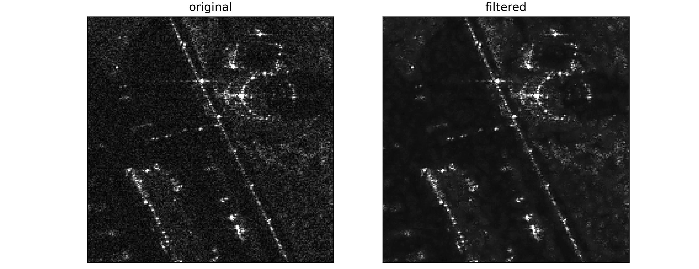
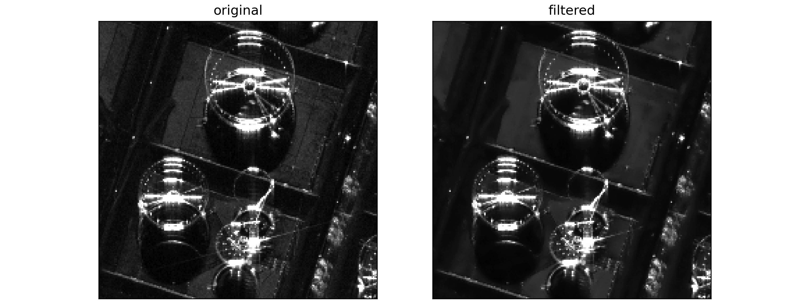

# Multi-directional Lee Filter for SAR Images

A high-performance Python implementation of the multi-directional Enhanced Lee filter for speckle noise reduction in Synthetic Aperture Radar (SAR) images. This filter preserves edges and linear features better than traditional Lee filters by analyzing image statistics along multiple directions.




## Features

- **Edge-preserving speckle reduction** - Uses directional analysis to maintain structural features
- **Multi-band support** - Process single or multiple bands simultaneously
- **Flexible noise thresholds** - Both absolute and relative noise control
- **NoData handling** - Intelligent padding and preservation of invalid pixels
- **High performance** - Numba-optimized for fast processing of large images
- **Geospatial metadata preservation** - Maintains coordinate systems and metadata

## Installation

### Requirements

```bash
pip install numpy numba rioxarray pathlib argparse
```

### Dependencies

- `numpy` - Numerical computations
- `numba` - Just-in-time compilation for performance
- `rioxarray` - Geospatial raster I/O
- `pathlib` - Path handling
- `argparse` - Command-line interface

## Usage

### Command Line Interface

#### Basic Usage
```bash
python multidirectional_lee_filter.py -i input.tif -o output.tif
```

#### Advanced Usage
```bash
# Custom window size and noise parameters
python multidirectional_lee_filter.py -i input.tif -o output.tif \
    --win-size 7 --noise-rel 0.8 --verbose

# Process specific bands
python multidirectional_lee_filter.py -i input.tif -o output.tif \
    --band-index 0 1 2 --win-size 11

# With absolute noise threshold
python multidirectional_lee_filter.py -i input.tif -o output.tif \
    --noise-abs 0.1 --noise-rel 1.2 --nodata -999
```

### Python API

```python
from multidirectional_lee_filter import multidirectional_lee_filter
import rioxarray as rxr

# Load SAR image
image = rxr.open_rasterio('sar_image.tif')

# Apply filter to first band
filtered_band = multidirectional_lee_filter(
    image.values[0], 
    win_size=9,
    noise_rel=1.0,
    nodata=0
)

# Replace original band with filtered result
image.values[0] = filtered_band
image.rio.to_raster('filtered_image.tif')
```

## Parameters

### Command Line Arguments

| Argument | Type | Default | Description |
|----------|------|---------|-------------|
| `-i` | str | Required | Path to input SAR image file |
| `-o` | str | Required | Path for output filtered image file |
| `--win-size` | int | 9 | Filter window size (NxN). Larger values = more smoothing |
| `--noise-abs` | float | None | Absolute noise threshold. If None, uses relative only |
| `--noise-rel` | float | 1.0 | Relative noise threshold multiplier |
| `--nodata` | float | nan | No-data value to mask during processing |
| `--band-index` | int+ | All bands | Band index(es) to process (0-based) |
| `--verbose` | flag | False | Enable verbose output |

### Function Parameters

```python
multidirectional_lee_filter(
    img_data,           # 2D numpy array - input image
    win_size=9,         # int - window size (odd number ≥ 3)
    noise_abs=None,     # float - absolute noise threshold
    noise_rel=1.0,      # float - relative noise threshold
    nodata=np.nan       # float - nodata value
)
```

## Algorithm Details

### Multi-directional Analysis

The filter works by:

1. **Directional Kernel Creation** - Generates line kernels in all directions across the analysis window
2. **Weighted Statistics** - Calculates weighted mean and standard deviation for each direction using dilated kernels
3. **Direction Selection** - Chooses the direction with minimum variance (typically the edge direction)
4. **Adaptive Filtering** - Applies filtering based on noise thresholds and local statistics

### Noise Thresholds

- **Absolute Threshold (`noise_abs`)** - Direct standard deviation cutoff
- **Relative Threshold (`noise_rel`)** - Multiplier of mean image standard deviation
- Both thresholds can be used together for fine-tuned control

### Window Size Guidelines

| Window Size | Use Case | Trade-off |
|-------------|----------|-----------|
| 3-5 | Preserve fine details | Less smoothing |
| 7-9 | Balanced (recommended) | Good balance |
| 11+ | Heavy smoothing | May blur features |

## Examples

### Example 1: Basic Sentinel-1 Processing
```bash
python multidirectional_lee_filter.py \
    -i sentinel1_grd.tif \
    -o sentinel1_filtered.tif \
    --verbose
```

### Example 2: Custom Parameters for ALOS PALSAR
```bash
python multidirectional_lee_filter.py \
    -i alos_palsar.tif \
    -o alos_filtered.tif \
    --win-size 7 \
    --noise-rel 0.6 \
    --band-index 0 1
```

### Example 3: High Noise Environment
```bash
python multidirectional_lee_filter.py \
    -i noisy_sar.tif \
    -o denoised_sar.tif \
    --win-size 11 \
    --noise-abs 0.2 \
    --noise-rel 1.5
```

## Performance Tips

1. **Start with default parameters** - `win_size=9`, `noise_rel=1.0`
2. **Adjust window size first** - Smaller for detail preservation, larger for smoothing
3. **Fine-tune noise_rel** - Lower values (0.5-0.8) for more aggressive filtering
4. **Use noise_abs sparingly** - Only when you know the noise characteristics
5. **Process bands selectively** - Use `--band-index` for specific bands only

## Output

- Preserves original data type and geospatial metadata
- Maintains coordinate reference system (CRS)
- NoData values are preserved in output
- Processing statistics displayed with `--verbose` flag

## Technical References

Based on the multi-directional Lee filter implementation from SAGA GIS and the following publications:

- Lee, J.S. (1980): Digital image enhancement and noise filtering by use of local statistics. IEEE Transactions on Pattern Analysis and Machine Intelligence, PAMI-2: 165-168.
- Lee, J.S., et al. (1998): A New Technique for Noise Filtering of SAR Interferometric Phase Images. IEEE Transactions on Geosciences and Remote Sensing 36(5): 1456-1465.
- Selige, T., et al. (2006): Processing of SRTM X-SAR Data to correct interferometric elevation models for land surface process applications.

### Getting Help

Run with `--verbose` flag to see detailed processing information and parameter validation.